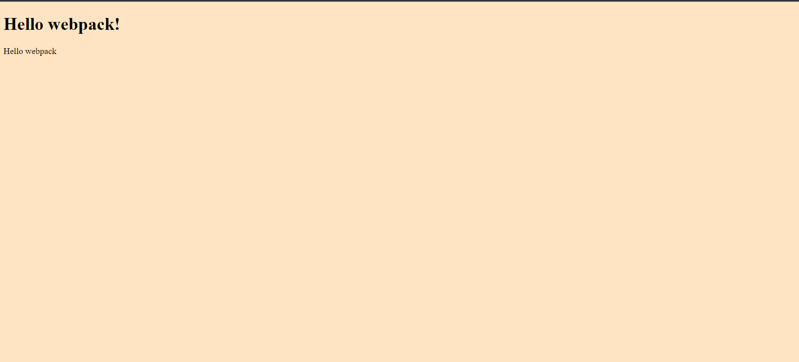

# The Webpack setup exercise

> This is a webpack setup exercise to familiarize myself with webpack tool for future usage in projects.

## Project screenshot




Additional description about the project and its features.

## Built With

- Webpack

## How to Setup
> You can simply clone or download [this repository](https://github.com/Mosams/webpack-setup.git), and use your favorite browser or code editor to run this program.

- To open the project after download, simply double click the index.html file in the dist folder of the project.

- To open this project using vs code ( for this example) or your favorite code editor, you can follow the guide below:
> in your cmd or command line navigate to where this project is located, then;
```cmd
cd microverse_portfolio_project 
```
> thereafter run
```cmd
code .
```

## Authors

👤 **Author1**

- GitHub: [@githubhandle](https://github.com/Mosams/)
- Twitter: [@twitterhandle](https://twitter.com/sam_mongare)
- LinkedIn: [LinkedIn](https://www.linkedin.com/in/sammy-mongare-b8288310b/)

## 🤝 Contributing

Contributions, issues, and feature requests are welcome!

Feel free to check the [issues page](../../issues/).

## Show your support

Give a ⭐️ if you like this project!